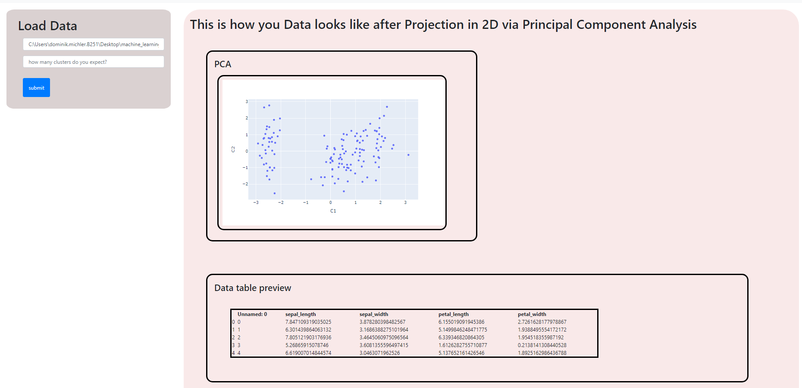
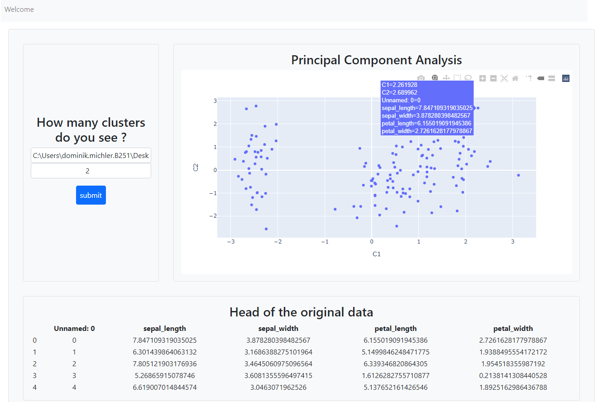

# machine_learning_clusters

## Motivation
Visualize, classify your complex multidimensional datasets with only two clicks. The app can be used in combination with my **MyDirtyDjango/DjangoMachineLearning/** repository

## How to use it

  
   
  

### Classify
### What do the results mean?

#### "Test" data results and crossvalidation

#### To which samples belong the points in the graphs

#### Get a feeling for the meaning of the results with createTestData.py
If you are not familiar with machine learning algorithms, it is important to get at least a rough idea of how to interpret the results. One way to achive this is to get "artificial experience" with different test datasets. For that use createTestData.py, which generates artificial test datasets on the base of your model data. Random samples from the model dataset are picked and a random number in the order of magnoitude of the roiginal value is added. How big this deviation is can be controlled by the deviationFactor (range: 0-1,recommended <0.1). The size of the artificial dataset is tunes by the fractionFactor (range: 0-1). Play around with different test datasets. 

## Details of the code in this project and lessons to be learned
### Crucial logics

###### Note: the URls of the model data and teh test data are also passed from view to view by meeans of hidden input forms such as the following

### How to get Plotly graphs from the views.py to a template 

### models.py

###### Note: The objects in the database are mainly identified by the url of the csv. Any modification in the original csv file (such as additional or corrected data) will thus only be recognized if the url is changed as well. 
Pandas Frames and plots are stored as PickleFireldobjects. 

#### deficites of the code

#### yet to be done

