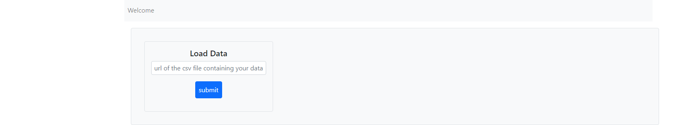

# machine_learning_clusters

  

## Motivation
Visualize and classify complex multidimensional datasets with only two clicks.  The app can be used in combination with my **MyDirtyDjango/DjangoMachineLearning/** repository

## How to use it
Load unclassified datasets from your local machine or remote resources via url. 

  

The dataset is then projected in two dimensions via Principal Component Analysis (**PCA**). A plotly express scatter plot will be displayed as in the following snapshot. Underneath you find the head of the data table you just loaded. Type the number of clusters (or increment by arrows) that you expect, meaning how many clusters do you see in the plot. Submit again.

   

Datapoints are now assigned to clusters in both, the plot and the data table underneath. The classification has taken place via the k_Means_Algorithm. The classified multidimensional data locally stored in the data folder for further processing. E.g. classify new data with my supervised machine learning application **DjangoMachineLearning**.

  

Test the application with the iris data under data/iris-test-data.csv

## Crucial parts of the code

### The dataflow

### models.py
Pandas Frames and plots are stored as PickleFireldobjects. 

### forms.py

### views.py
In the following I will roughly explain how the views.py works, for a detailed explanation please read teh comments in the file itself. The views.py consists of two parts, one that processes your data set and one for the actual views. Througout both parts classes inherit from top to bottom. 

The first part has three classes. The first step is to read in a dataset which is achieved by the class **ClusterBaseData**. The dataset is then saved as a pickle object in the database for future analysis. The **DimReduction** class projects the muiltidimensional data into two dimensions via PCA and saves both, a datatable and a plot of the new 2D dataset. This class is applied twice, for the raw (yet unclassified) data and the classified data. The latter will be delivered by the class **Cluster**, which applies the k-Means_method to classify the **DimReduction** objects. 

The second part of views.py contains two views. THe IndexView inherits from **FormView** and **TemplateView** to process the inputform and the results in the same time. It also inherits all methods of the dataprocessing part by the class **Clusters**. Initially only the form is displayed. On submitting the url, the 2D plot and the head of the datatable of the original nonclassified data is shown. If then the number of expected clusters is submited the class **ResultsView** is called which has basically the same structure but processes the clustered data instead of the nonclassified. 

